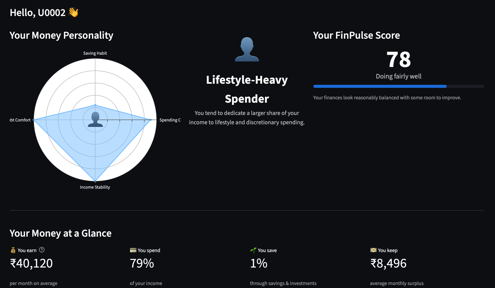
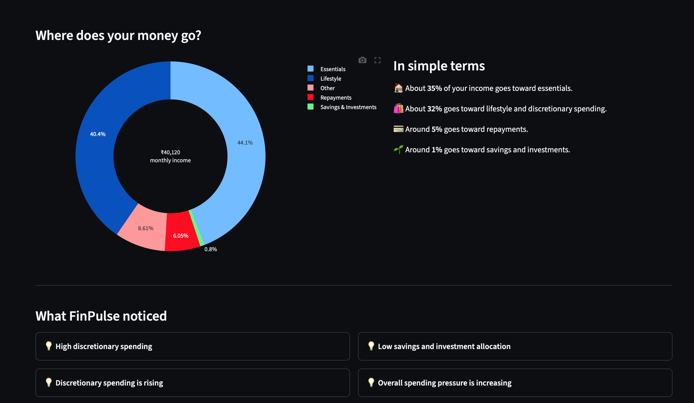
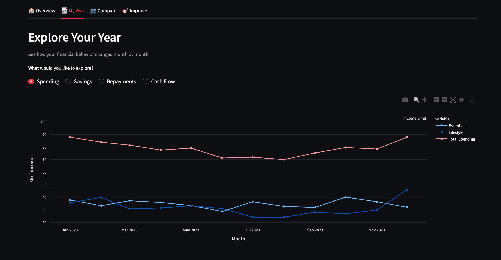
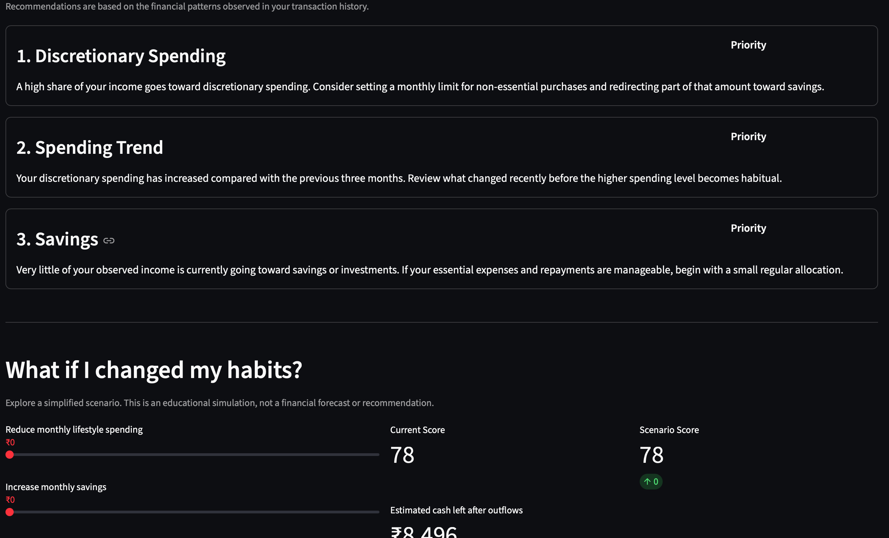

# FinPulse — Behavioral Finance Analytics for UPI-Style Transactions

FinPulse is an end-to-end behavioral finance analytics project that analyzes UPI-style transaction data to understand how users manage money.

The project combines:

- Synthetic financial data generation
- SQLite-based data storage
- SQL feature engineering
- Python and Pandas analytics
- Unsupervised machine learning with KMeans
- Rule-based financial scoring
- Behavioral signals and recommendations
- Interactive Streamlit dashboards

The main goal is not just to classify transactions, but to build a simple behavioral view of a user's financial habits.

---

## Project Objective

Traditional transaction dashboards mainly show what a user spent.

FinPulse goes a step further by trying to answer questions such as:

- How much of the user's income goes toward essential spending?
- Is discretionary spending increasing?
- Is repayment pressure high?
- Does the user consistently allocate money toward savings or investments?
- Is the user's income stable or variable?
- Is the user frequently overspending?
- Which broader behavioral pattern does the user resemble?
- What financial areas should the user focus on improving?

FinPulse converts transaction-level data into user-level behavioral insights.

---

## Key Features

### Behavioral Segmentation

FinPulse uses KMeans clustering to discover groups of users with similar financial behavior.

The clustering model uses features such as:

- Essential spending ratio
- Desire spending ratio
- Repayment ratio
- Investment ratio
- Expense ratio
- Overspending frequency
- Income variability
- Expense volatility

KMeans produces numerical clusters rather than predefined personas.

After examining the average financial characteristics of each cluster, the clusters are interpreted and given human-readable behavioral names.

The current behavioral segments are:

- Consistent Savers
- Lifestyle-Heavy Spenders
- Debt-Constrained Users
- Financially Stretched Users
- Variable-Income Users

This keeps the machine learning process unsupervised while making the results understandable to users.

---

## FinPulse Score

FinPulse also generates an interpretable financial wellness score out of 100.

The score is based on four components:

| Component | Maximum Score |
|---|---:|
| Spending Control | 30 |
| Savings | 25 |
| Debt | 25 |
| Stability | 20 |
| **Total** | **100** |

The overall score is converted into simple financial health bands such as:

- Strong
- Stable
- Watchful
- Strained
- High Pressure

Unlike the clustering model, the FinPulse Score is deliberately rule-based so that the logic remains transparent and explainable.

---

## Behavioral Signals

FinPulse generates behavioral signals from the engineered user features.

Examples include:

- High spending pressure
- Frequent overspending
- High repayment burden
- High discretionary spending
- Low savings allocation
- Variable income
- Increasing spending trends
- Improving or declining financial behavior

These signals help explain why a user received a certain score or recommendation.

---

## Personalized Recommendations

FinPulse converts financial patterns into prioritized recommendations.

Recommendations may focus on:

- Spending control
- Savings allocation
- Debt management
- Lifestyle spending
- Income stability
- Overspending behavior

The system currently uses deterministic rules rather than generative AI.

This makes the recommendation logic easy to inspect and explain.

---

# System Architecture
```text
Reference Transaction Dataset
            │
            ▼
Synthetic Data Generator
            │
            ▼
SQLite Database
   users + transactions
            │
            ▼
SQL Feature Engineering
            │
            ├── Monthly Features
            ├── User-Level Features
            └── Behavioral Trends
            │
            ▼
Python / Pandas Feature Engineering
            │
            ▼
      user_features
            │
     ┌──────┼───────────┐
     │      │           │
     ▼      ▼           ▼
  KMeans  FinPulse   Behavioral
 Clusters   Score      Signals
     │      │           │
     └──────┼───────────┘
            │
            ▼
     Recommendations
            │
            ▼
    Streamlit Dashboard
```
---

# Dataset Strategy

FinPulse uses a synthetic UPI-style financial dataset representing:

* 1,000 users
* 12 months of financial activity
* Multiple transaction categories
* Different income levels
* Different spending and saving behaviors

The synthetic dataset is generated using controlled behavioral assumptions so that the population contains a realistic range of financial patterns.

The original reference transaction dataset is used only as a supporting input for parts of the synthetic data generation process.

The production dataset used by the application is stored directly in SQLite rather than maintained as duplicate CSV files.

---

## Transaction Categories

Transactions are grouped into six high-level financial categories:

* Income
* Essentials
* Desire
* Repayment
* Investment / Savings
* Others

The project intentionally uses broad behavioral categories instead of detailed merchant-level classification because the main objective is customer financial behavior analysis.

---

# Database Design

FinPulse uses SQLite as the central source of truth.

The database contains base, derived, and analytical tables.

### Base Tables

* `users`
* `transactions`

### Feature Tables

* `monthly_features`
* `user_features_base`
* `user_trends`
* `user_features`

### Analytical Output Tables

* `behavioral_signals`
* `user_scores`
* `recommendations`
* `user_segments`
* `cluster_profiles`

This structure separates raw transaction storage from analytics and model outputs.

---

# SQL Feature Engineering

SQL is used for meaningful analytical transformations rather than only data retrieval.

The project includes three major SQL pipelines.

### Monthly Feature Engineering

`sql/01_monthly_features.sql`

Creates user-month financial metrics using conditional aggregation.

Examples include:

* Monthly income
* Essential spending
* Desire spending
* Repayment
* Investment allocation
* Total outflow
* Monthly surplus
* Category ratios
* Transaction counts
* Overspending flags

### User-Level Feature Engineering

`sql/02_user_features.sql`

Aggregates monthly behavior into long-term user characteristics.

Examples include:

* Average income
* Average spending ratios
* Average savings ratio
* Average repayment ratio
* Expense ratio
* Monthly transaction activity
* Overspending frequency

### Behavioral Trend Engineering

`sql/03_user_trends.sql`

Uses CTEs and SQL window functions to compare recent behavior.

For example, it compares the most recent three months with the previous three months for:

* Income
* Desire spending
* Repayment
* Investment
* Expense ratio
* Surplus ratio

This allows FinPulse to identify whether a user's financial behavior is improving or deteriorating.

---

# Python Feature Engineering

SQL-generated features are enriched using Pandas and NumPy.

Additional features include:

* Median income
* Income standard deviation
* Income coefficient of variation
* Expense ratio volatility
* Desire spending volatility
* Repayment volatility
* Investment volatility

The final feature table is stored as:

`user_features`

This table becomes the main analytical input for segmentation, scoring, signals, and recommendations.

---

# Machine Learning — KMeans Segmentation

FinPulse uses unsupervised learning because there are no reliable ground-truth labels defining the correct financial persona for each user.

Before clustering, features are standardized using `StandardScaler`.

KMeans is evaluated across multiple values of `k` using:

* Elbow method
* Silhouette score
* Cluster interpretability

The final model uses:

KMeans(
    n_clusters=5,
    random_state=42,
    n_init=20
)


The selected features are:

FEATURE_COLUMNS = [
    "avg_essential_ratio",
    "avg_desire_ratio",
    "avg_repayment_ratio",
    "avg_investment_ratio",
    "avg_expense_ratio",
    "overspending_month_ratio",
    "income_cv",
    "expense_ratio_volatility",
]


---

## Cluster Interpretation

The model itself only discovers numerical clusters.

Cluster names are assigned after analyzing the average financial profile of each cluster.

For example, a cluster with:

* High discretionary spending
* Low investment allocation
* High expense ratio
* Stable income

can reasonably be interpreted as:

**Lifestyle-Heavy Spenders**

This separation is important:

> KMeans discovers similar behavioral groups. Human interpretation gives those groups meaningful financial labels.

---

# Exploratory Data Analysis

The project contains two notebooks.

### `01_eda.ipynb`

Focuses on:

* Data quality
* Transaction distributions
* Income distributions
* Category behavior
* Monthly financial activity
* Overspending
* Allocation ratios
* Population-level trends
* Individual user examples

### `02_clustering_analysis.ipynb`

Focuses on:

* Feature preparation
* Feature scaling
* Elbow analysis
* Silhouette scores
* Final KMeans model
* Cluster sizes
* Cluster profiles
* PCA visualization
* Behavioral interpretation
* Production model validation

The notebooks are used for analysis and model justification.

They are not part of the runtime application pipeline.

---

# Streamlit Dashboard

FinPulse includes two dashboard versions.

### Main Dashboard

`app/app.py`

This is the polished user-facing version.

It focuses on presenting financial insights in a simple and understandable way.

Major sections include:

* Financial overview
* Money personality
* FinPulse Score
* Income allocation
* Behavioral signals
* Annual financial trends
* Overspending timeline
* Peer comparison
* Recommendations
* What-if simulation

## Dashboard Preview

### Financial Overview





### Yearly Behavioral Analysis



### Personalized Improvement



### Analytical Dashboard

`app/app_v1.py`

The earlier dashboard is retained as a more analytical version of the application.

---

# Dashboard Experience

The main dashboard is designed around four areas:

### Overview

Provides a quick summary of the user's financial behavior.

Includes:

* Money personality
* FinPulse Score
* Financial health summary
* Income allocation
* Behavioral observations

### My Year

Shows how the user's financial behavior changes over time.

Users can explore:

* Spending
* Savings
* Repayments
* Cash flow
* Overspending periods

### Compare

Compares the selected user with:

* Their behavioral segment
* The broader user population

This helps provide context rather than showing financial metrics in isolation.

### Improve

Shows prioritized financial recommendations and includes a simplified what-if simulator.

The simulator demonstrates how changing discretionary spending or savings allocation could affect parts of the FinPulse Score.

It is intended for educational exploration rather than financial forecasting.

---
# Project Structure
```text

Finpulse/
│
├── app/
│   ├── app.py
│   └── app_v1.py
│
├── data/
│   ├── raw/
│   │   └── MyTransaction.csv
│   │
│   └── validation/
│       ├── finpulse_generation_audit.csv
│       └── finpulse_monthly_generation_validation.csv
│
├── database/
│   └── finpulse.db
│
├── notebooks/
│   ├── 01_eda.ipynb
│   └── 02_clustering_analysis.ipynb
│
├── scripts/
│   ├── generate_finpulse_dataset.py
│   ├── build_features.py
│   ├── signal_engine.py
│   ├── score_engine.py
│   ├── recommendation_engine.py
│   ├── segmentation_engine.py
│   └── run_pipeline.py
│
├── sql/
│   ├── 01_monthly_features.sql
│   ├── 02_user_features.sql
│   └── 03_user_trends.sql
│
├── .gitignore
├── requirements.txt
└── README.md
```
---

# Running the Project

## 1. Clone the Repository

git clone <your-repository-url>
cd Finpulse


## 2. Create a Virtual Environment


python3 -m venv venv
source venv/bin/activate


On Windows:


venv\Scripts\activate


## 3. Install Dependencies


pip install -r requirements.txt


## 4. Run the Full Data Pipeline


python3 scripts/run_pipeline.py


The pipeline executes:


Synthetic Data Generation
        ↓
SQL + Python Feature Engineering
        ↓
Behavioral Signals
        ↓
FinPulse Score
        ↓
Recommendations
        ↓
KMeans Segmentation


Individual scripts can also be executed separately if required.

---

## 5. Launch the Dashboard


streamlit run app/app.py


The analytical V1 dashboard can be launched with:


streamlit run app/app_v1.py


---

# Technology Stack

| Area                           | Technology                     |
| ------------------------------ | ------------------------------ |
| Programming                    | Python                         |
| Data Processing                | Pandas, NumPy                  |
| Database                       | SQLite                         |
| Querying / Feature Engineering | SQL                            |
| Machine Learning               | Scikit-learn                   |
| Clustering                     | KMeans                         |
| Model Evaluation               | Silhouette Score, Elbow Method |
| Visualization                  | Plotly, Matplotlib             |
| Dashboard                      | Streamlit                      |
| Analysis                       | Jupyter Notebook               |

---

# Design Decisions

### Why Unsupervised Learning?

A supervised model would require reliable labels describing the correct behavioral persona for every user.

Those labels are not available.

Therefore, FinPulse uses unsupervised learning to discover natural behavioral groupings directly from financial features.

---

### Why Keep Scoring Rule-Based?

Financial scoring should remain understandable.

A rule-based FinPulse Score makes it possible to explain exactly why a user gained or lost points.

This complements KMeans:

* KMeans answers: **Which behavioral group does this user resemble?**
* FinPulse Score answers: **How healthy do the user's current financial patterns appear under the project's scoring framework?**

---

### Why Use Both SQL and Python?

SQL handles structured aggregation and trend calculations efficiently inside the database.

Python is used for statistical calculations, modeling, analysis, and application logic.

This creates a realistic analytical workflow instead of forcing all processing into one technology.

---

# Limitations

FinPulse is a portfolio and educational analytics project rather than a production financial product.

Important limitations include:

* The user population is synthetically generated.
* Synthetic behavioral profiles are based on predefined assumptions.
* Transaction categories are already available at a high level.
* Merchant-level transaction classification is outside the current project scope.
* Cluster names are human interpretations of unsupervised groups.
* KMeans assumes relatively simple cluster geometry.
* The FinPulse Score is heuristic and has not been statistically calibrated against real financial outcomes.
* Recommendations are rule-based and are not personalized financial advice.
* The project currently uses 12 months of historical behavior.
* The what-if simulator is a simplified scenario tool rather than a forecasting model.

---

# Future Improvements

Potential future development could include:

* Validation using real anonymized financial datasets
* Longer multi-year transaction histories
* Cluster stability analysis
* Alternative clustering algorithms
* Behavioral drift detection
* More advanced peer-group comparisons
* Real-time transaction ingestion
* Improved recommendation personalization
* Time-series forecasting with sufficient historical data
* Production database migration from SQLite
* Authentication and user-level privacy controls

Large language models or RAG could also be explored in the future for natural-language financial explanations, but only where they provide meaningful value beyond the current deterministic recommendation engine.

---

# What This Project Demonstrates

FinPulse demonstrates an end-to-end data analytics and machine learning workflow involving:

* Data generation and validation
* Relational database design
* Advanced SQL transformations
* Feature engineering
* Exploratory data analysis
* Statistical behavioral analysis
* Unsupervised machine learning
* Model evaluation and interpretation
* Explainable scoring systems
* Rule-based recommendation systems
* Dashboard development
* End-to-end pipeline automation
* Product-oriented presentation of analytical insights

The focus of the project is not on using the maximum number of technologies, but on building a coherent analytics system where each component has a clear purpose.

---

## Disclaimer

FinPulse is an educational and portfolio project.

The generated scores, behavioral segments, insights, simulations, and recommendations should not be interpreted as professional financial advice.
